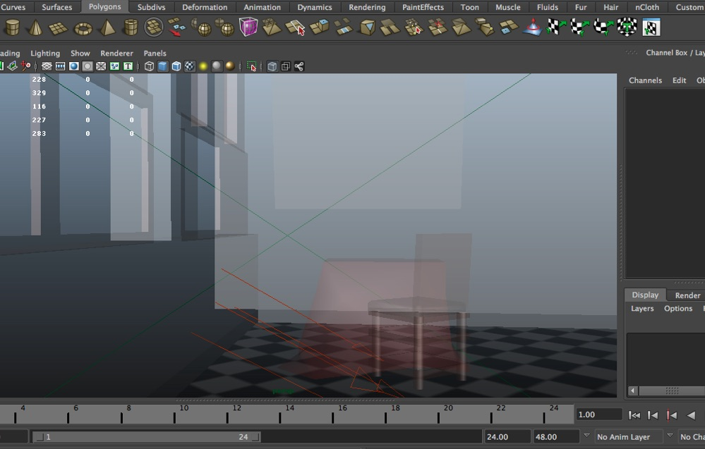
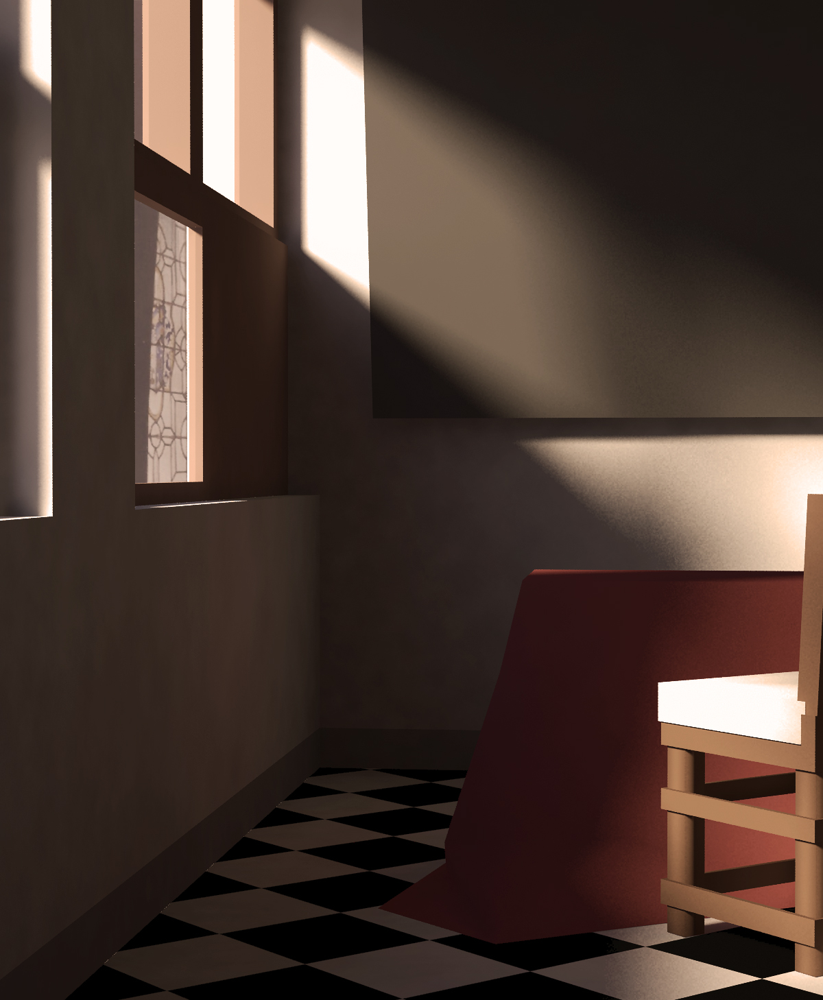
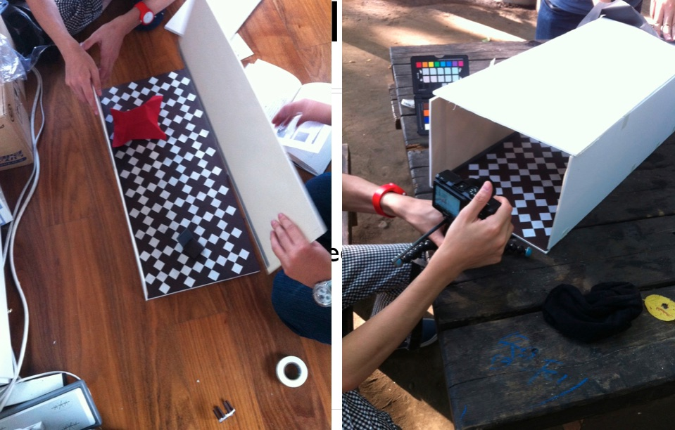
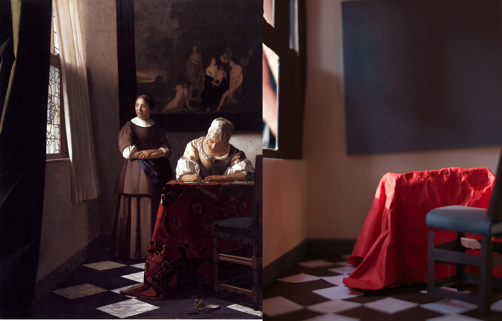

# Vermeer box

3D data reconstructed from Vermeer's painting https://en.wikipedia.org/wiki/Lady_Writing_a_Letter_with_her_Maid

Good for your global illumination research and miniture modeling.

3D model is provided by wavefront .obj format.

## License

 

3D data is modeled by Yasutoshi Mori(@MirageYM) and licensed under Creative Commons Attribution 4.0 International License.

Photos are copyright Light Transport Entertainment, Inc.
